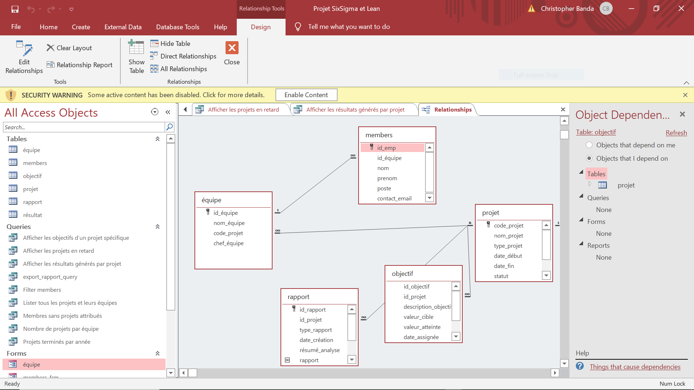
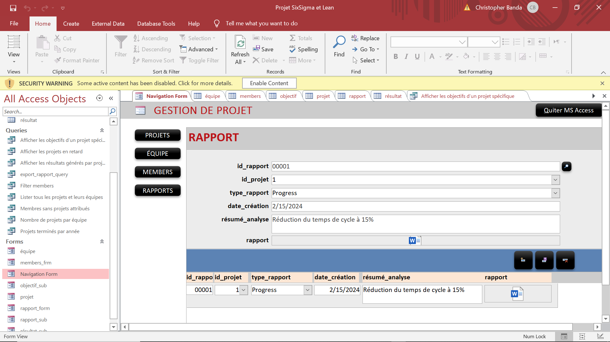
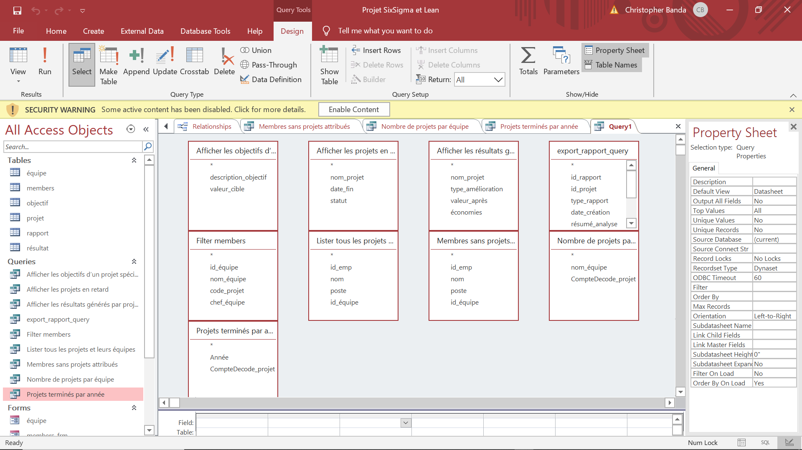

# Project Management & Performance Tracking System

## Overview
This project is a relational database system built using Microsoft Access to manage projects, teams, and performance metrics.

It was developed using a structured database engineering approach, including:
- Data dictionary
- Functional dependencies
- Conceptual Data Model (MCD)
- Logical Data Model (MLD)
- Implementation using tables, queries, forms, and reports

The system simulates a real-world environment for managing continuous improvement projects (Lean / Six Sigma).

---

## Features

- Project management (status, timelines, types)
- Team organization and member assignment
- Objective tracking (target vs achieved values)
- Performance analysis (before/after comparison and savings)
- Reporting system for project insights

---

## Database Structure

The system is composed of the following main entities:

- **Projects**
- **Teams (Équipes)**
- **Members**
- **Objectives**
- **Results**
- **Reports**

Relationships are implemented using primary and foreign keys to ensure data integrity and consistency.

---

## Key Concepts Applied

- Relational database design
- Entity relationships and normalization
- Functional dependencies
- Data modeling (MCD, MLD)
- Query-based data analysis
- User interface design (forms)

---

## Queries

The system includes queries for:

- Listing all projects and their teams
- Filtering members
- Identifying members without assigned projects
- Counting projects per team
- Displaying project results and performance metrics

---

## User Interface

Forms were implemented to improve usability and interaction with the system:

- Project form
- Team form
- Member form
- Objective form
- Results form
- Navigation form

These forms allow efficient data entry, modification, and visualization.

---

## System Preview

### Database Relationships

### User Interface (Form Example)

### Query Example

---

## How to Run

1. Download the `.accdb` file from the `/database` folder
2. Open it using Microsoft Access
3. Enable content if prompted

---

## Documentation

A full technical report is available here:

[Project Report](docs/project management system report.pdf)

---

## Contributors

This project was developed as part of a team:

- Your Name
- AOUALTITE Meryem
- GHARIB Fatima

---

## Future Improvements

- Rebuild the system using SQL and Python
- Add automation and analytics dashboards
- Improve scalability and performance
